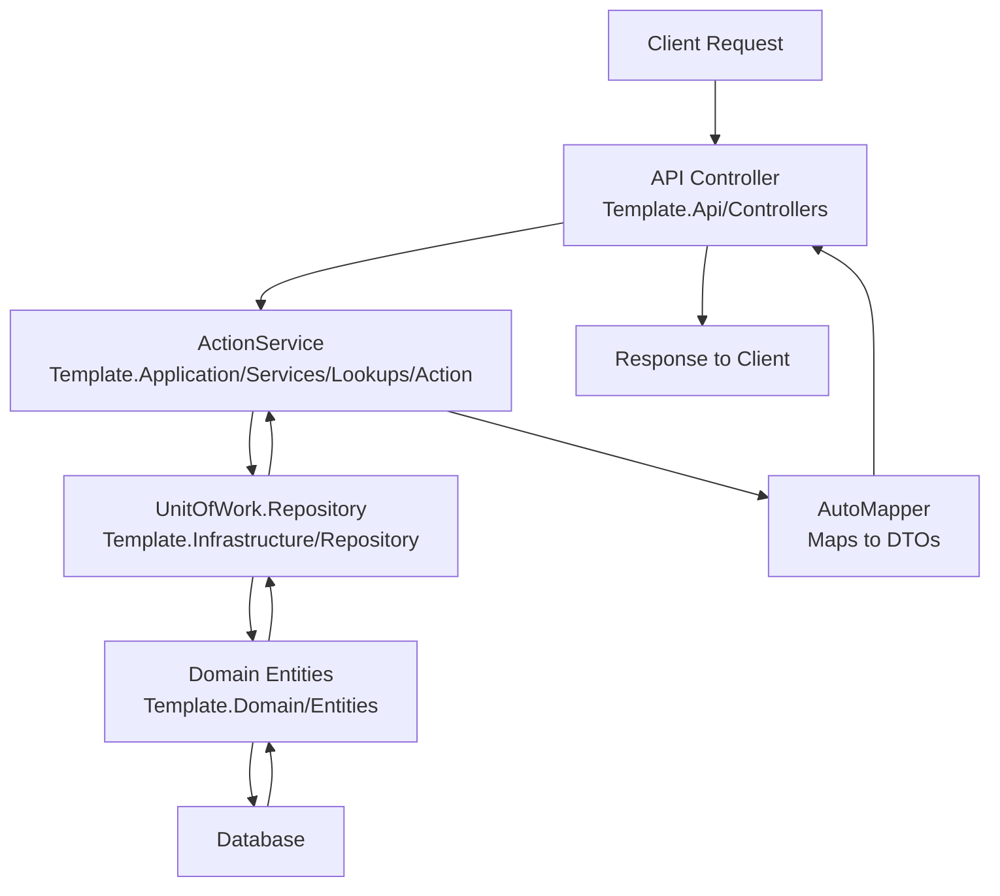
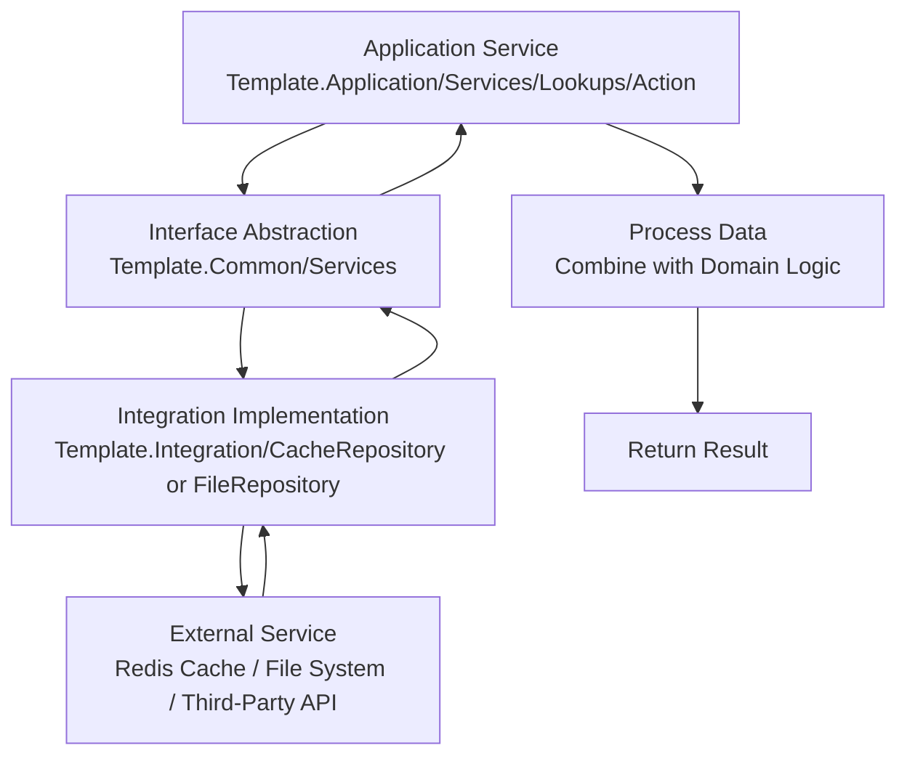

# .NET 9 Clean Architecture
Clean Architecture For .NET 9 Web Api

## Architecture Overview

This project follows the Clean Architecture principles, which emphasize separation of concerns, dependency inversion, and maintainability. The architecture is divided into several layers, each with distinct responsibilities, ensuring that the core business logic remains independent of external frameworks and technologies.

### Layers

- **Web Api Layer** (Template.Api)
  - Handles HTTP requests and responses
  - Contains controllers, middleware, and API versioning
  - Responsible for routing, authentication, and authorization
- **Application Layer** (Template.Application)
  - Contains business logic and application services
  - Implements use cases and orchestrates domain objects
  - Includes services like ActionService for handling lookup operations
- **Common Layer** (Template.Common)
  - Provides shared utilities, DTOs, and abstractions
  - Acts as a bridge between high-level (Application) and low-level (Infrastructure) layers
  - Includes caching, configurations, and common helpers
- **Domain Layer** (Template.Domain)
  - Defines core business entities and domain models
  - Contains business rules, enums, and constants
  - Independent of any external frameworks
- **Infrastructure Layer** (Template.Infrastructure)
  - Handles data access and external integrations
  - Implements repositories, unit of work, and database migrations
  - Manages database context and entity configurations
- **Integration Layer** (Template.Integration)
  - Manages external third-party services and integrations
  - Includes cache and file repositories for external data sources

### Key Principles Applied

- **Dependency Inversion**: Higher-level modules do not depend on lower-level modules; both depend on abstractions
- **Single Responsibility**: Each layer and class has a single reason to change
- **SOLID Principles**: Applied throughout the codebase for better design
- **Generic Repository and Unit of Work**: For consistent data access patterns

## Request Flow Diagram

The following diagram illustrates the flow of a typical request using the ActionService as an example. When a client sends a request to retrieve actions (e.g., via a GET endpoint), the flow follows these steps:

1. **Client Request**: The request arrives at the API layer
2. **API Controller**: Routes the request to the appropriate controller method
3. **Application Service**: ActionService handles the business logic, applying filters and pagination
4. **Repository**: Uses the repository pattern to query the database
5. **Domain Entities**: Core business objects are retrieved or manipulated
6. **Database Interaction**: Data is fetched from the underlying database
7. **Mapping**: Results are mapped to DTOs using AutoMapper
8. **Response**: The formatted response is sent back to the client

This flow ensures separation of concerns, with each layer focusing on its specific responsibility while maintaining loose coupling.

## Integration Flow Diagram

The following diagram illustrates how the Integration layer can be injected into the Application layer to integrate with external services for fetching data. For example, the ActionService might need to retrieve cached data or files from external sources, using dependency injection of abstractions defined in the Common layer.

1. **Application Service**: ActionService requires external data (e.g., cached actions or files)
2. **Interface Abstraction**: Calls an interface defined in the Common layer (e.g., ICacheRepository)
3. **Integration Implementation**: The concrete implementation in the Integration layer handles the external interaction
4. **External Service**: Fetches data from Redis, file system, or third-party APIs
5. **Data Processing**: The retrieved data is processed and combined with domain logic
6. **Result**: The integrated data is returned for use in the application service

This pattern allows the Application layer to remain decoupled from specific external technologies, adhering to Clean Architecture principles.

# Features

- Generic crud operations
- Auto Mapper
- SOLID Principles Applied
- Generic Repository And Unit Of Work Pattern
- User Management Module (managing user role and permission per page level)
- Redis Caching
- Audit Trails
- Logging Using Serilog To Sql Server Database
- Fluent Scheduler (For Background Tasks)
- Swagger Documentation
- JWT Authentication
- Policy Based Authorization
- Form Based (Username And Password) Authentication And LDAP Authentication
- Api Versioning
- Hangfire Background Services and Cron jobs
- Feature Flag Management 

# Road Map
- [x] Add Feature Flags Management
- [X] Add Hangfire with Dashboard
- [ ] Add Dashboard For Audit Trails Logs
- [ ] Add Logging Dashboard
- [ ] Add Prometheus And Grafana Dashboard For Monitoring And Health Checks
- [ ] Add AMQP (Rabbit MQ And Masstransit)
- [ ] Add External Providers Authentication (Google , Azure AD , Facebook)
- [ ] Use File-Scoped Namespaces to make refactor easier
- [ ] Run Unit Tests using Iteration Count like (1000) case for the test till it fails 
- [ ] Add Seq Logging
- [ ] Add Postgress SQL Database Support along with Sql Server 
- [ ] Use ClaimPrincipalExtensions to add better extension methods to get claim values from token
- [ ] Refactor BaseService to remove the inputs to the service
- [ ] Add https://www.flagsmith.com/
- [ ] Use https://youtube.com/shorts/NLopFJ-EtKA?feature=share
- [ ] Token Management With Identity Provider with OAuth 2
# Installation

- clone the repository
- run Update-Database through PMC(Package Manager Console)
- try login using Username: Admin ; Password:123456

# Releases
- current release version is 9.1.0
